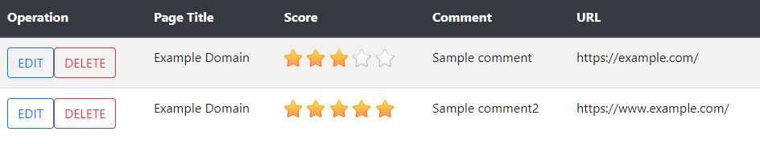
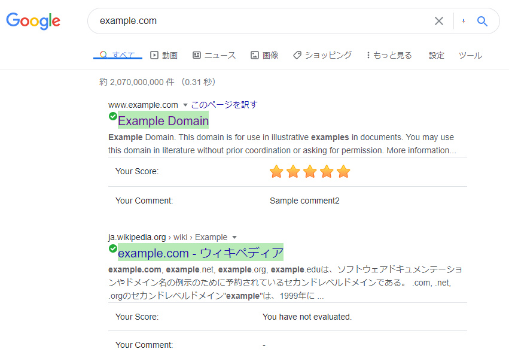

# My Page Rating Extension

Chrome extension which enables you to rate web sites and view the scores in Google search result page.

===

## Background

Google search in your device is optimized for your preferences and behavior. 
However, it's unclear whether Google search results necessarily reflect your real preferences. 
In fact, web pages that you don't feel you need are often displayed at the top of the search results. 
Thus, this extension enables you to rate websites and to view the scores in Google search results.

## Setup

1. Clone this repository.

2. Execute setup-site-packages.sh or setup-site-packages.bat.
    - Note: the scripts need `curl`.

3. Add this extension to your chrome.
    - See [Manifest Section in Getting Started Tutorial - Google Chrome](https://developer.chrome.com/extensions/getstarted#manifest)

## How to Use

This extension provides the following two functions:

- To rate websites:

    1. Visit a website which you want to rate.
    2. Click "My Page Rating Extension" icon at the top right of Chrome or use "Alt+Shift+R" to activate rating page. 
    3. Input your score and comment for the website.
    4. Press "Rate this page" button.

    

    Note: you can edit or delete your past score. Just press "Show All" button on the rating page.

    

- To view your scores for websites:
    
    1. Just search on Google. Your scores and comments automatically are displayed in the search result page.

    

## How to Develop

Just edit the manifest and services.

## Note

- Your scores in this extension on a device are valid only on the device. In other words, you cannot use the scores on another device.

## Ref.

- [What are extensions? - Google Chrome](https://developer.chrome.com/extensions)